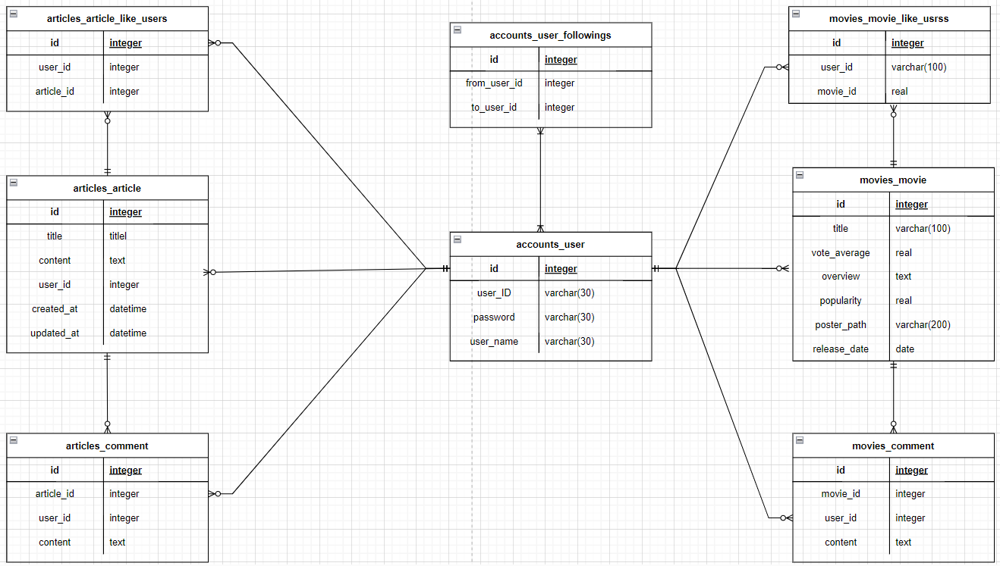

# Final pjt

# **팀원 정보 및 업무 분담 내역**

### 팀장 : 박단비

- DJango : accounts App, articles App
- user, movies, articles, comments json 데이터 생성
- Vue : 로그인, 로그아웃, 회원가입, 게시글 생성 및 조회, 댓글 생성, 프로필 조회 관련 View, components 및 store 작성

### 팀원 : 손재형

- Django : articles App, movies App
- Vue : 메인 페이지, 검색 페이지, 영화 상세정보 조회, youtube api를 이용한 예고편 조회, 워드 클라우드 생성 관련 View, components 및 store 작성

### 기술 스택
🛠 **Backend**
   
  
  
  
  

🛠 **Frontend**
   
  
  
  
  

🛠 **Collaboration**
   
  
  
  

# 목표 서비스 구현 및 실제 구현 정도

### 목표 서비스 :

- 워드클라우드로 영화 추천 하기
- 영화 검색 기능
- 영화 좋아요 누르기
- 영화 상세조회 페이지에서 youtube api를 이용하여 예고편 출력
- 영화 상세 페이지에서 게시글 생성
- 게시글 및 댓글 생성, 수정 및 삭제
- 다른 이용자의 프로필을 통해 좋아요 누른 영화와 작성한 게시글 보기 및 팔로우 기능

### 실제 구현 :

- 워드클라우드로 영화 추천 하기
- 영화 검색 기능
- 영화 좋아요 누르기
- 영화 상세조회 페이지에서 youtube api를 이용하여 예고편 출력
- 게시글 및 댓글 생성
- 다른 이용자의 프로필을 통해 좋아요 누른 영화와 작성한 게시글 보기 및 팔로우 기능

# 데이터베이스 모델링 (ERD)

# 영화 추천 알고리즘에 대한 기술적 설명

- 이용자는 영화 상세조회 페이지에서 해당 영화가 마음에 들면 좋아요를 누릅니다.
- 이용자가 좋아요를 누른 영화들의 줄거리 데이터를 모아서
- 해당 데이터들을 형태소 분석을 통해 의미를 가진 단어들로 쪼갭니다.
- 그렇게 나온 단어들의 빈도를 분석하여
- 워드 클라우드를 생성합니다.
- 워드 클라우드의 각 글자를 선택하면 해당 단어를 검색한 결과를 출력해줍니다.
- 그렇게 나온 영화들 중 자신이 원하는 영화를 클릭해서 해당 영화 상세페이지로 넘어가게  됩니다.

# 서비스 대표 기능에 대한 설명

- TMDB API를 이용하여 상위 2000개의 영화 데이터를 포함하고 있습니다.
- 그 영화들의 제목, 줄거리에 포함된 단어를 검색할 수 있습니다.
- 영화 상세 페이지에서 해당 영화에 대한 좋아요 기능이 가능합니다.
- 그리고 youtube api를 이용하여 해당 영화의 예고편을 함께 보여줍니다.
- community에 게시글을 작성할 수 있고 각 게시글마다 댓글을 작성할 수 있습니다.
- 게시글 작성자를 클릭하여 해당 작성자의 프로필 페이지로 넘어가고,
- 다른 이용자의 프로필 페이지에서는 팔로우 기능이 가능합니다.
- 그리고 해당 이용자가 작성한 게시글, 좋아요를 누른 영화를 볼 수 있습니다.
- 자신의 프로필 페이지에는 자신이 좋아요를 누른 영화 데이터를 기반으로 형성된 워드 클라우드가 출력됩니다.
- 워드 클라우드의 각 글자를 클릭하면 해당 글자를 검색한 결과가 출력됩니다.

# 기타(느낀 점, 후기 )

### 박단비

- 우선 프로젝트라는 걸 처음 해봤는데 생각보다 많이 쉽지 않았습니다. 솔직히 처음 프로젝트 시작할 때는 매주 하던 관통프로젝트와 똑같이 영화를 주제로 하고있고, 관통프로젝트에서 기능들을 몇개씩 구현했었기 때문에 너무 쉽게 끝나는거 아닐까 생각을 했었습니다. 그러나 완전 달랐습니다. 수업때 실습했던 코드, 관통 프로젝트 코드 참고 해도 내가 생각한 결과대로 나타나지 않아서 당황한 적이 많습니다.
- 생각나는대로 코드를 치다보니까 중간에 길을 잃는 경우도 많았습니다. 메모장에 지금 해야할 기능이 무엇이고, 어떤식으로 로직을 작성해야할지 고민하고 적어놓고 나서 하는게 결과적으로 오류도 덜 나고, 효율도 좋다는 것을 느꼈습니다.
- 기획을 생각보다 구체적으로 해야한다는 것을 깨달았습니다. 기능적인 기획을 하고 바로 코드를 작성하니까 특히 vue부분에서 중복되는 데이터도 많고, 그걸 다 store에 넣어놓으니까 찾기도 힘들고, 코드를 따라가면서 해석해야한다는 점이 귀찮았습니다. 그리고 vue내부에 컴포넌트도 너무 쪼개면 오히려 디자인 할 때나 함수 실행할 때 번거로워질 수 있다는걸 알게되었습니다.
- 그리고 비동기 요청을 보내면 생각대로 코드가 실행되지 않아서 어려웠던 순간이 많았습니다. 그리고 데이터를 불러오는 데에 생각보다 오래 시간이 걸릴 수 있고, 그러면 이용자들이 충분히 불편할 수 있겠구나 라는걸 느꼈습니다.

### 손재형

- 백서버와 프론트서버를 연결한 프로젝트를 처음 해보면서 느낀 것은, 초반 기획을 좀 더 세밀하게 짤 필요가 있고 DRY 법칙에 대해 전적으로 공감하게 되었다.
- 백서버에서 비동기로 불러온 정보들을 다루기 편하도록 대부분을 vue의 store에 담아뒀고 그 중 일부 조건을 제외하면 중복되는 데이터가 꽤 많았다.
- 초반에 한, 두개 정도는 어떤 것 인지 파악이 되어 조건이 조금 다르다면 또 다시 불러오는 식으로 했었는데, 그 양이 많아질 수록 감당이 되지 않는다는 것을 느꼈고 작업을 하는데 있어서 능률을 감소시켰다.
- 사실, 프로젝트 초반에 기획에 사용할 시간을 길게 가져가고 싶었으나 생각 이상으로 프로젝트에 주어진 시간이 짧다는 것을 알게 되었고, 기획에 시간을 줄일 수 밖에 없었다.
- 부족한 시간을 잘 활용해서 조금 더 신경써서 작업했다면 조금 더 좋은 성과를 낼 수 있지 않았을까 라는 생각이 들었다.

# 코드 실행 관련 참고사항

movies.json, articles.json, comments.json, users.json 파일에 데이터가 들어있습니다. 처음 migrate 하고 loaddata 하시면 됩니다.

워드 클라우드 생성하는 코드가 자바에서 실행되고, 이 결과를 파이썬이 번역해오는 과정을 거치기 때문에 워드 클라우드를 실행하려면 컴퓨터에 자바가 설치되어 있어야하고, 시스템 환경변수 Path, JAVA_HOME, CLASSPATH가 되어 있어야합니다.
